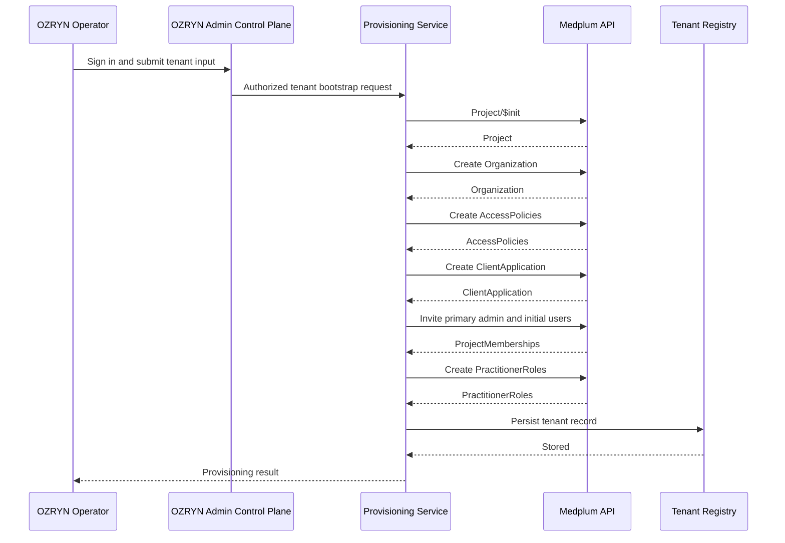

# OZRYN Medplum Provisioning Flow

## Purpose

Define the server-side provisioning flow for creating a new OZRYN tenant backed by Medplum.

This flow covers:

- Medplum project creation
- Root organization creation
- Tenant app client creation
- Primary tenant admin invite
- Optional initial user list invite
- PractitionerRole linkage to tenant Organization
- Tenant registry persistence

This flow does not cover:

- External IdP integration
- Production automation infrastructure
- Billing or sales onboarding

## Principles

1. Provisioning uses supported Medplum APIs only.
2. Provisioning credentials are server-only.
3. No human super-admin account is embedded in runtime code.
4. Every tenant gets an isolated Medplum project.
5. Every tenant gets a tenant-specific `ClientApplication`.
6. Every human user is project-scoped in MVP.

## Integration Boundary

OZRYN should not expose its own REST API solely to wrap Medplum.

Preferred implementation model:

- OZRYN server actions or other server-only calls invoke Medplum through the Medplum SDK
- Medplum remains the actual platform/API boundary
- Medplum App is an acceptable operator surface when the cost of automating a workflow in OZRYN is not justified

If this server-action-first rule starts creating more complexity than it removes, that tradeoff should be called out explicitly before adding more abstraction.

## Actors

- OZRYN operator: human initiating tenant creation
- OZRYN provisioning service: server-side route or job that performs setup
- Medplum super-admin provisioning client: server-only `ClientApplication`
- OZRYN admin control plane: dedicated non-tenant host for operator workflows
- Tenant admin: primary invited human admin for the tenant

## Inputs

```ts
type ProvisionTenantInput = {
  slug: string;
  displayName: string;
  primaryAdmin: {
    firstName: string;
    lastName: string;
    email: string;
    password?: string;
    sendEmail?: boolean;
  };
  initialUsers?: Array<{
    firstName: string;
    lastName: string;
    email: string;
    role: 'TenantAdmin' | 'Staff';
    password?: string;
    sendEmail?: boolean;
  }>;
  customDomains?: string[];
};
```

## Outputs

```ts
type ProvisionTenantResult = {
  slug: string;
  canonicalDomain: string;
  medplumProjectId: string;
  medplumOrganizationId: string;
  medplumClientId: string;
};
```

## Provisioning Sequence

### Step 1: Validate input

Validate before any Medplum write:

- slug format and reserved words
- display name present
- primary admin email present
- bootstrap users use unique email addresses
- custom domains normalized and unique

### Step 2: Create Medplum project

Use the server-only provisioning client to call Medplum `Project/$init`.

Expected outcome:

- new isolated Medplum `Project`
- project owner set to provisioning identity or explicit owner if required

Why:

- Medplum `Project` is the true cross-tenant data boundary
- this is the resource we map to the OZRYN tenant

### Step 3: Create root Organization

Inside the new project, create the tenant root `Organization`.

Required semantics:

- one root organization per tenant project
- organization name matches tenant `displayName`
- organization id is stored in the tenant registry

The `Organization` is used for domain modeling, future practitioner roles, and tenant branding metadata. It is not the primary cross-tenant boundary.

### Step 4: Create default AccessPolicies

Create the initial least-privilege policies inside the tenant project:

- `TenantAdmin`
- `Staff`
- `ServiceBot`

MVP intent:

- `TenantAdmin`: project administration and broad tenant operations
- `Staff`: normal clinical operations within the tenant
- `ServiceBot`: tightly scoped programmatic access

For this phase, the policies are tenant-internal role policies. They are not the mechanism for cross-tenant isolation; that is already provided by separate Medplum projects.

### Step 5: Create tenant web ClientApplication

Create a Medplum `ClientApplication` inside the tenant project for the OZRYN web app.

This client is used by the tenant-facing login flow and must be stored in the tenant registry.

Required properties:

- name tied to tenant identity
- redirect URI aligned with the tenant login host for the current environment
- access policy appropriate for the web app

Important:

- this is not the same as the provisioning client
- each tenant gets its own Medplum app client

### Step 6: Invite bootstrap users

Invite the primary tenant admin and any optional initial staff/admin users using Medplum's invite endpoint.

Rules:

- resource type is `Practitioner`
- human bootstrap users are email-first for this phase
- user scope is `project`
- the primary admin is admin-enabled for the tenant project
- additional `TenantAdmin` users are admin-enabled for the tenant project
- `Staff` users receive the tenant `Staff` access policy when it exists
- bootstrap invites may set `password` for local/dev flows or rely on invite/reset flows when email delivery is configured

This ensures the primary tenant admin can sign in and operate only inside their own project, while additional staff remain tenant-scoped as well.

### Step 7: Create PractitionerRole links

For invited human staff/admin users, create `PractitionerRole` resources linking the invited `Practitioner` profile to the tenant root `Organization`.

Why:

- keeps organization affiliation explicit
- aligns with OZRYN's current organization inference helper
- avoids leaving bootstrap users unattached to the tenant organization model

### Step 8: Persist tenant registry entry

After Medplum resources are created, write the resulting tenant record to the OZRYN tenant registry.

For MVP, this registry is a local file managed by the app.

Stored values:

- slug
- display name
- domains
- canonical domain
- Medplum base URL
- project id
- organization id
- client id

Do not store:

- client secret
- super-admin credentials
- bearer tokens

### Step 9: Verify tenant bootstrap

Run post-create checks:

- tenant resolves by slug/domain
- Medplum client id is present
- root organization exists
- primary admin membership exists
- optional initial user memberships exist when requested
- invited practitioners are linked to the tenant organization with `PractitionerRole` when automation succeeded
- login target points to the tenant client

## Canonical Domain Rules

Canonical domain selection:

- if a verified custom domain exists, use it
- otherwise use `slug.ozryn.app` in production
- for local development, allow `slug.localhost:3000`

Non-canonical domains redirect to the canonical domain.

## Failure Handling

Provisioning is not truly atomic, so the service must detect partial failure.

Rules:

- if project creation fails, stop
- if project exists but later steps fail, record failure state and surface exact recovery action
- do not silently retry steps that can create duplicate memberships or clients
- log all created Medplum resource ids for manual cleanup or replay

## Security Requirements

- provisioning routes must be authenticated and server-only
- provisioning credentials must never be exposed to the browser
- the runtime OZRYN app must not hold super-admin capability
- the admin control plane may exist as a separate privileged surface, but must stay isolated from tenant runtime
- all tenant users remain project-scoped in MVP
- cross-tenant access tests are mandatory before feature rollout

## Suggested Runtime Split

- provisioning plane: server-only privileged flow
- tenant runtime plane: standard tenant-aware web app flow

This separation keeps super-admin capability out of normal user sessions.

For current local runtime/auth realities and debugging notes, see `docs/architecture/local-medplum-dev-notes.md`.
For the operator host/auth model, see `docs/architecture/admin-control-plane.md`.

## Sequence Diagram



## Out of Scope for the Next Phase

These are intentionally deferred:

- External IdP and token bridging
- Automated custom-domain verification workflow
- Self-service tenant signup
- Per-tenant branding assets and themes

## References

- [Medplum Project $init](https://www.medplum.com/docs/api/fhir/operations/project-init)
- [Medplum Client Application Endpoint](https://www.medplum.com/docs/api/project-admin/client)
- [Medplum Invite User Endpoint](https://www.medplum.com/docs/api/project-admin/invite)
- [Medplum Projects](https://www.medplum.com/docs/access/projects)
- [Platforms Guide: Multi-Tenant Platforms Quickstart](https://platforms.guide/platforms/docs/multi-tenant-platforms/quickstart)
