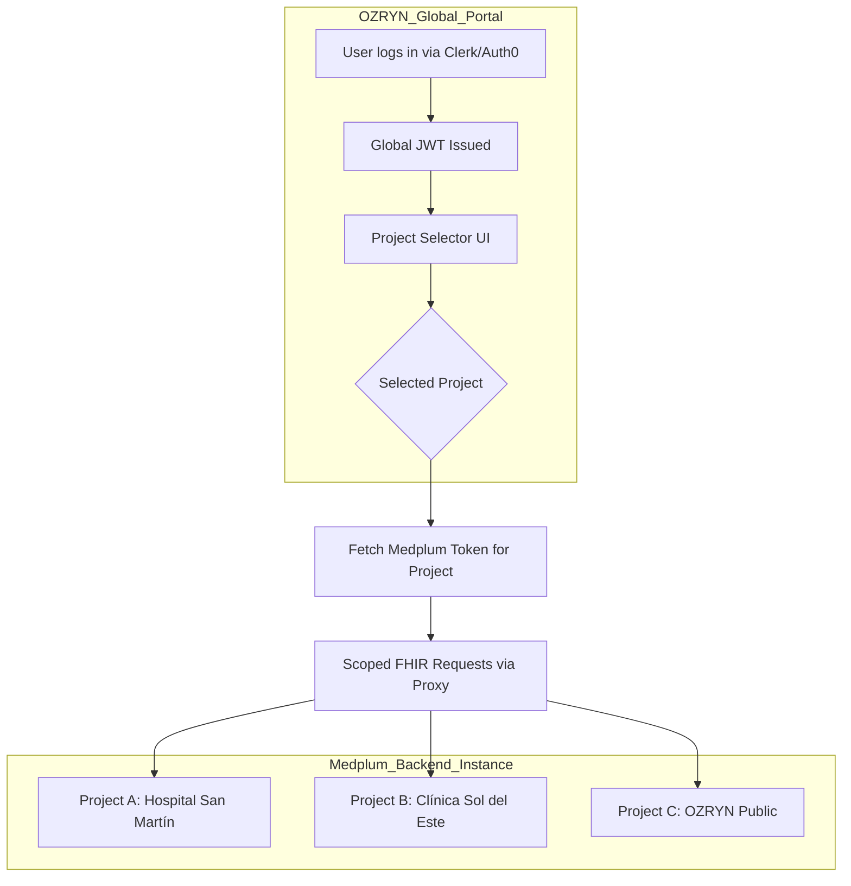

```mermaid
graph TD
  subgraph OZRYN_Global_Portal
    A[User logs in via Clerk/Auth0] --> B[Global JWT Issued]
    B --> C[Project Selector UI]
    C --> D{Selected Project}
  end

  D --> E[Fetch Medplum Token for Project]
  E --> F[Scoped FHIR Requests via Proxy]

  subgraph Medplum_Backend_Instance
    G1[Project A: Hospital San Martín]
    G2[Project B: Clínica Sol del Este]
    G3[Project C: OZRYN Public]
  end

  F --> G1
  F --> G2
  F --> G3

```